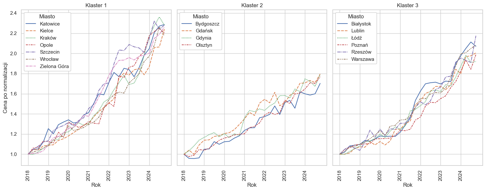
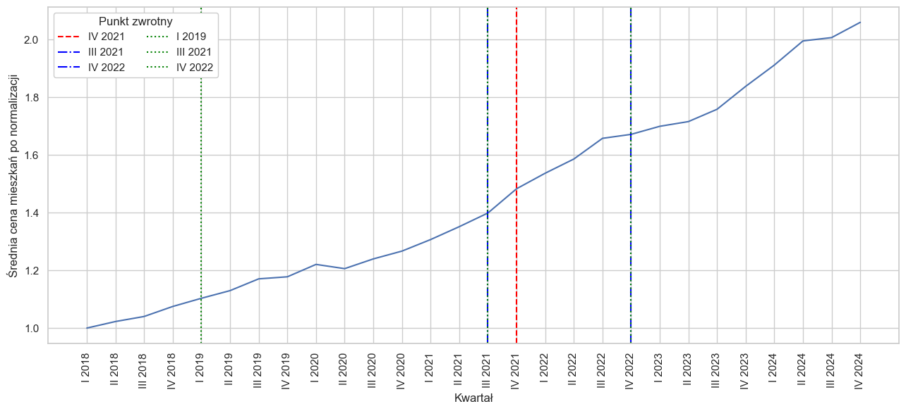

# Housing Price Analysis in Poland (2018-2024)

## Project Overview
This project analyzes housing price dynamics in 17 major Polish cities between 2018 and 2024.  
The dataset was cleaned and normalized, then explored with:
- **Time series clustering** (DTW + TimeSeriesKMeans),
- **Breakpoint detection** (PELT),
- **Visualization of trends and structural changes**.

The goal was to identify major turning points in the housing market and group cities with similar price dynamics.


## Data
- Source: **National Bank of Poland (NBP)**, quarterly transaction prices of apartments.  
- Period: **Q1 2018 - Q4 2024**  
- Cities: 17 largest Polish cities (e.g., Warsaw, Kraków, Gdańsk, Wrocław).

## How to run
```
pip install -r requirements.txt
jupyter notebook housing-price-analysis.ipynb
```
The dataset (`housing-prices-primary.xlsx`) is included in the repository.


## Methods

### 1. Clustering (TimeSeriesKMeans + DTW)
- Compared cities based on similarity of housing price trajectories.  
- Optimal number of clusters determined using **silhouette score**.  
- Results:  
  - For the full period: best fit with `k = 2–3`,  
  - For sub-periods: e.g., in “Period II” the best fit was `k = 3`.

### 2. Breakpoint Detection (PELT)
- Detected statistically significant turning points in housing price dynamics.
- Key breakpoints: **Q1 2019**, **Q3 2021**, **Q4 2022**.

## Key Findings
- Prices rose from **4-8k PLN/m²** (Q1 2018) to **9-17k PLN/m²** (Q4 2024).
- Three city clusters identified based on price trajectory similarity:
  - **Western/southern cities** - strong, stable growth (e.g. Wrocław, Kraków)
  - **North-central cities** - slow growth
  - **Central/eastern cities** - dynamic growth


- Three structural breakpoints detected, each aligned with a macroeconomic event:
  - **Q1 2019** - end of cheap credit phase
  - **Q3 2021** - pre-adjustments before interest rate hikes
  - **Q4 2022** - slowdown due to war, inflation, and reduced mortgage activity



## Publication
This repository contains the code and data underlying the following published chapter:

Kozaczewska, K. (2025). *Analiza cen mieszkań w wybranych miastach w Polsce za pomocą metod klasyfikacji oraz wykrywania punktów zwrotnych szeregów czasowych*. In A. Grześkowiak & P. Peternek (Eds.), *Zastosowanie metod ilościowych w ekonomii i finansach* (pp. 93-105). Wydawnictwo Uniwersytetu Ekonomicznego we Wrocławiu.

- DOI: [10.15611/2025.11.1.07](https://doi.org/10.15611/2025.11.1.07)
- Digital library record: [Dolnośląska Biblioteka Cyfrowa](https://dbc.wroc.pl/publication/187774)
- ORCID: [0009-0002-1084-0284](https://orcid.org/0009-0002-1084-0284)

## License

Code in this repository is licensed under the MIT License.

The published chapter associated with this project is available via Dolnośląska Biblioteka Cyfrowa under CC BY-SA 4.0. The housing price data comes from the National Bank of Poland (NBP).
